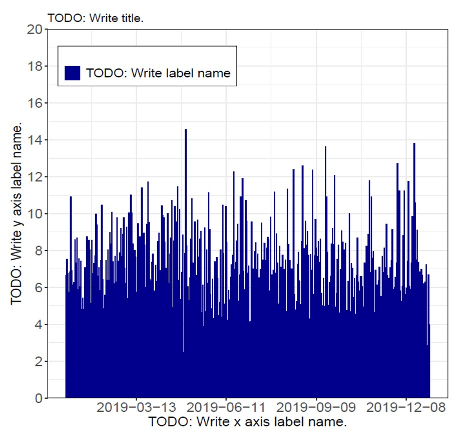
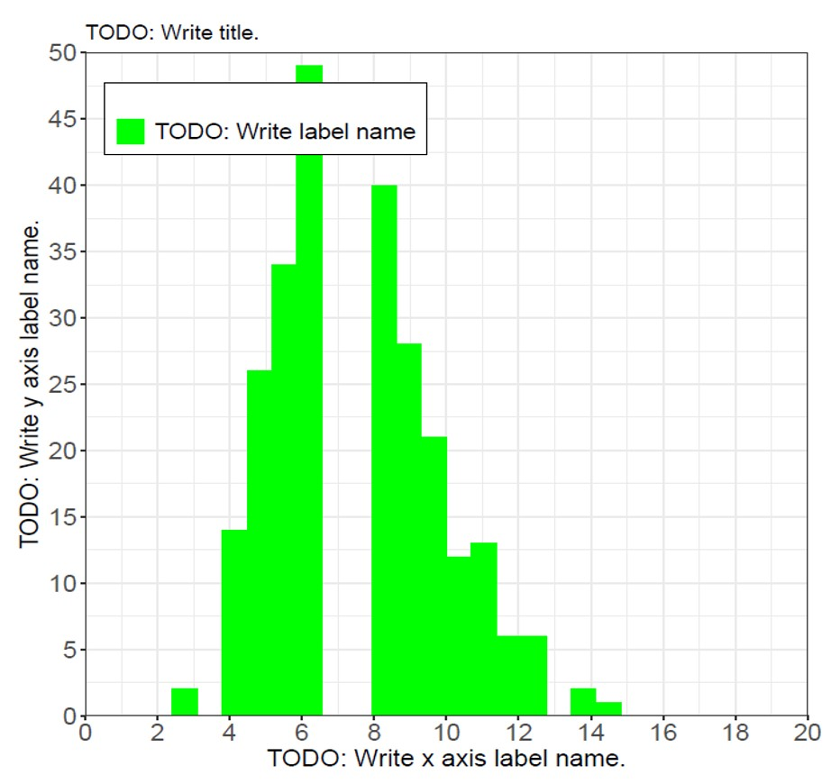
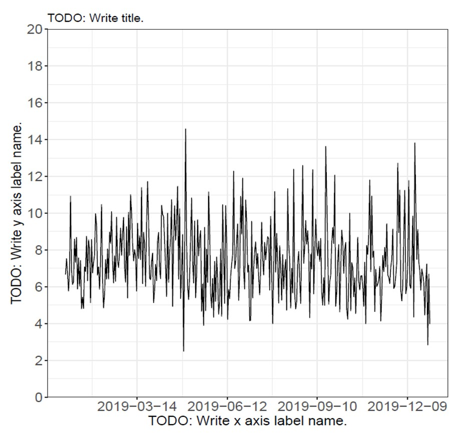
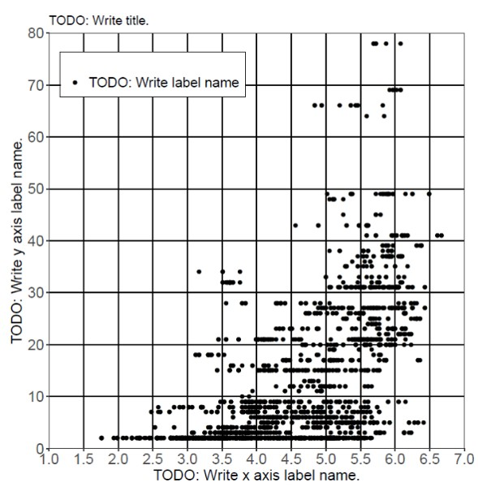

# Rlang-ggplot2-wrapper

Wrapper class for ggplot2 in Rlang.

## Features

- Render graphs using ggplot2.
- Command modularization using R6 class.

### Samples

- Bar

  

- Histgram

  

- Line

  

- Scatter plot

  

## Requirement

- Required:
  - Rlang 3.6+
  - tidyverse
  - R6

- Option:
  - R Studio

## Usage

1. Install related packages.
2. Prepare data and read in "main.r".
3. Run "main.r".

## Installation

Paste the following commands at a Terminal prompt.

```terminal
$ mkdir hogehoge
$ cd hogehoge

$ git clone git@github.com:KATO-Hiro/Rlang-ggplot2-wrapper.git
```

## Getting started

```rsudio console
# Install packages if needs.
install.packages("tidyverse")
install.packages("R6")

# Move to working directory.
setwd("path//Rlang-ggplot2-wrapper//src//")

# Check working directory.
getwd()

# Run code
# 1. Press the below keys at the same time.
Ctrl + Shift + Enter

# 2. console in Rstudio or R.
source("main.r")
```

## Links

[ggplot2 reference](https://ggplot2.tidyverse.org/reference/)

[ggplot2 samples (in Japanese)](https://mrunadon.github.io/%E6%A6%82%E8%A6%81%E3%82%92%E3%81%8A%E3%81%95%E3%81%88%E3%81%A6ggplot2%E3%82%92%E4%BD%BF%E3%81%84%E3%81%93%E3%81%AA%E3%81%99%E3%83%81%E3%83%A5%E3%83%BC%E3%83%88%E3%83%AA%E3%82%A2%E3%83%AB%E3%81%A8%E3%82%B3%E3%83%BC%E3%83%89%E9%9B%86/)

[tidyverse](https://www.tidyverse.org/packages/)

[R6 in CRAN](https://cran.r-project.org/web/packages/R6/R6.pdf)

[Readme Driven Development; RDD](https://qiita.com/b4b4r07/items/c80d53db9a0fd59086ec)

## Author

[@KATO-Hiro](https://twitter.com/k_hiro1818)

## License

[MIT](http://KATO-Hiro.mit-license.org)
